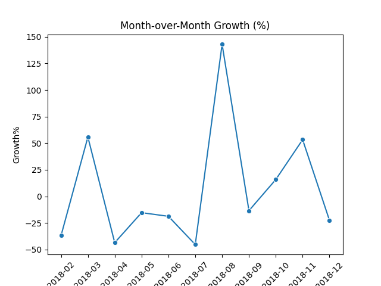

# E-commerce Sales Analysis: Insights from Order & Sales Data

## 1. Objective
The goal of this project is to analyze an e-commerce order and sales dataset to extract key business insights, including top selling states, categories, products, and trends over time.

---

## 2. Dataset Description
- **Source:** Sample / Random e-commerce dataset  
- **Columns:**
  - `Order ID`: Unique identifier for each order
  - `Order Date`: Date of the order
  - `CustomerName`: Name of the customer
  - `State`: Customer's state
  - `City`: Customer's city
  - `Amount`: Sales amount
  - `Profit`: Profit on the order
  - `Quantity`: Number of items ordered
  - `Category`: Product category
  - `Sub-Category`: Sub-category of the product
  - `PaymentMode`: Mode of payment

---

## 3. Data Cleaning Steps
- Removed duplicate rows
- Handled missing values
- Corrected data types (`Order Date` as datetime, `Amount` & `Profit` as float)
- Standardized column names

---

## 4. Analysis & Visualization

### **Top 5 States by Sales**
  
**Insight:** Certain states contribute more to overall sales, showing regional demand patterns.

### **Category-wise Sales Distribution**
  
**Insight:** Some product categories generate higher sales, indicating customer preferences.

### **Monthly Sales Trend**
  
**Insight:** Sales fluctuate over months, showing peak and low demand periods.

### **Payment Mode Analysis**
  
**Insight:** Customers show preference for certain payment methods over others.

### **Top Products**
  
**Insight:** Specific products consistently generate the highest sales.

### **City-wise Sales**
  
**Insight:** Certain cities have higher sales volume, indicating geographic demand concentration.

### **Month-over-Month Growth**
  
**Insight:** Growth trends reveal sales momentum and periods of increased customer activity.

---

## 5. Conclusion
This analysis provides insights into which states, cities, categories, and products drive maximum sales in the dataset. Understanding payment preferences and sales trends can help e-commerce businesses optimize inventory, marketing, and regional strategies.

---

## 6. Future Improvements
- Build an interactive dashboard using **Streamlit** or **Plotly Dash**.
- Add predictive analysis to forecast future sales trends.
- Include customer segmentation analysis to identify target segments.
